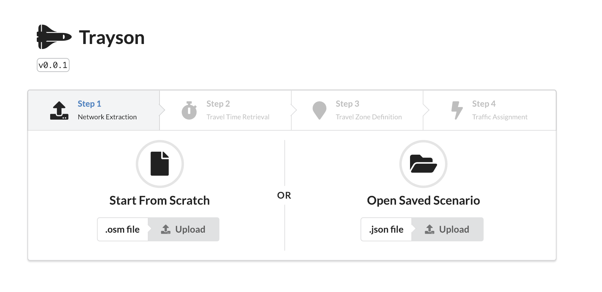
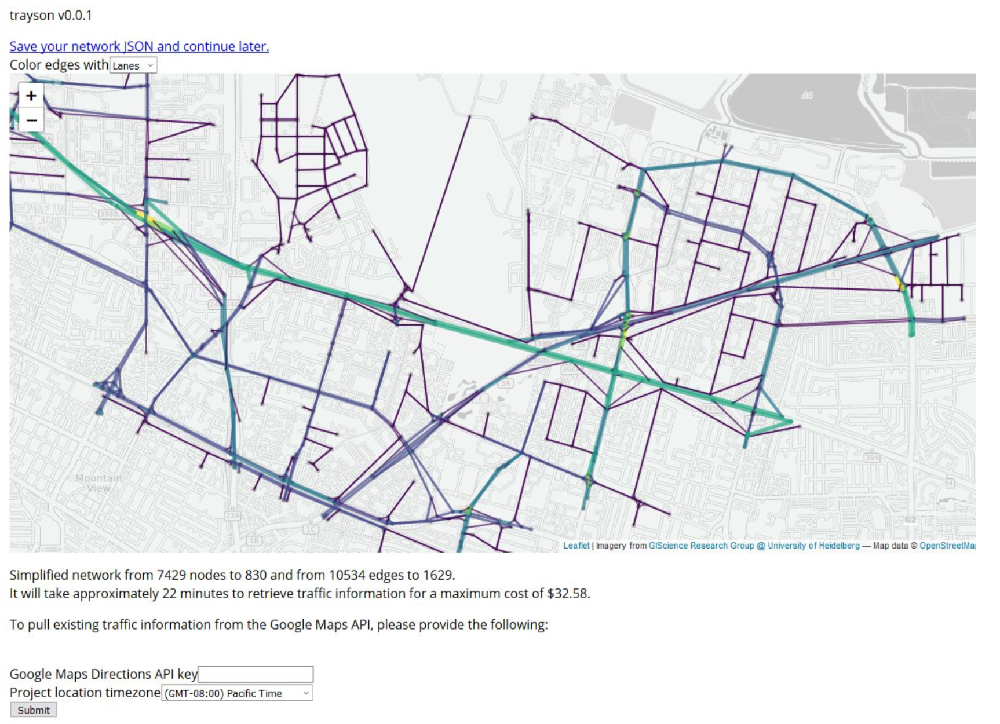

# Trayson

Trayson is a web app for doing quick traffic assignment. 






# Instructions

The traffic assignment script is only compatible with Julia 0.6. Download the generic 64-bit 0.6.4 Linux binary tarball from [here]('https://julialang.org/downloads/oldreleases.html'). Extract the tar into the root of the repository - rename this folder 'julia-0.6'. 

Once completed, run the following commands from the root of the repository:

1. Run `npm install` within the root directory.
2. Run `docker build -t trayson-app .`

Once the container has been built, it can be invoked with the following command:

```
docker run -p 5000:5000 trayson-app
```

The application will be available at http://0.0.0.0:5000/

# Want to colloborate?

We've been thinking of:

- Use the Alpine image to reduce container size.
- Find a more elegant way of including the Julia 0.6 distribution rather than literally copying it into the container itself.
- Provide some basic CSS styling to lighten up the application interface.

Reachout if you've any thoughts!

# References

This tool uses a fantastic julia package from [chkwon](https://github.com/chkwon/) for the traffic assignment. The repo is [here](https://github.com/chkwon/TrafficAssignment.jl). 

# Contributors

Carlin Liao & Mike Iswalt with some input from Michael Byrne and Gerry Casey.

